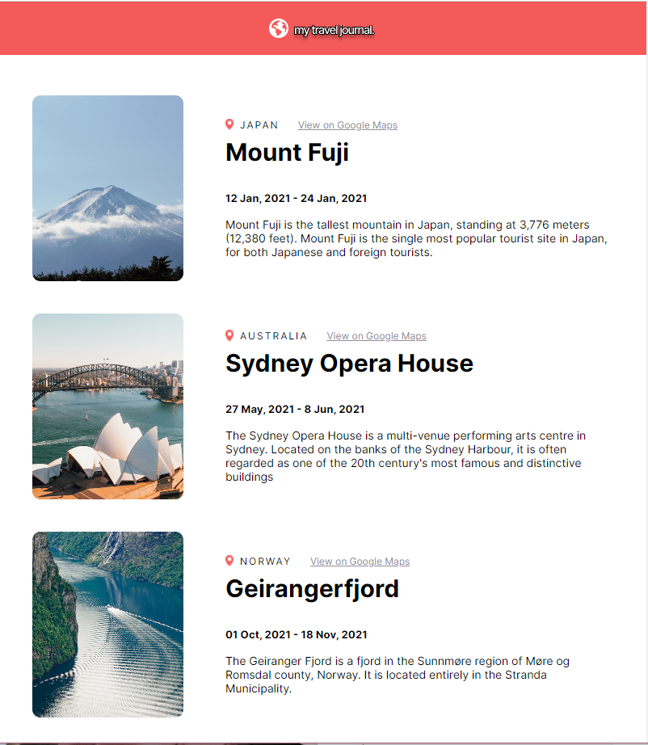
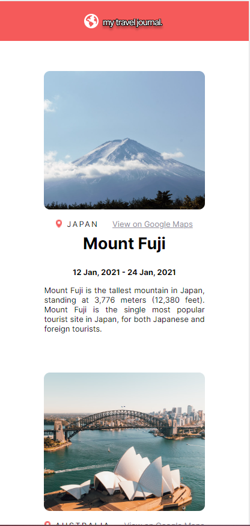

# React -- Travel Journal

This is a travel journal made with React JS.

## Table of contents

- [Overview](#overview)
  - [The challenge](#the-challenge)
  - [Screenshot](#screenshot)
  - [Links](#links)
- [My process](#my-process)
  - [Built with](#built-with)
  

## Overview

### The challenge

- Use data array in a separate .js file
- Create entries using .map() and props
- Optimal layout for the app depending on the device's screen size

### Screenshot

### Links

- Live Site URL: [lidijaaltraveljournal.netlify.app](lidijaaltraveljournal.netlify.app)

## My process

### Built with

- HTML
- CSS
- React JS
